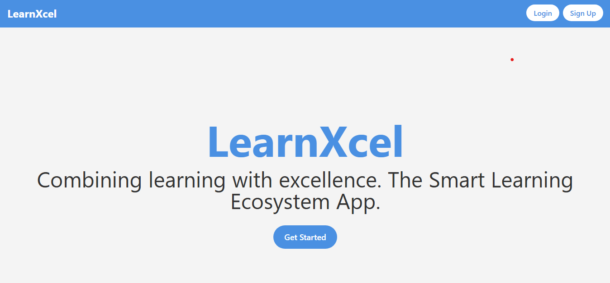

[<div></div>](https://ai-study-assistant.vercel.app)

# LearnXcel

This is a project that combines a `Next.js`. The frontend is built using Next.js, a React framework, while the backend is powered by Flask, a lightweight Python web framework.

## Locally Setup

1. **Install Dependencies**: Navigate to the `frontend` directory and install the required npm packages listed in `package.json`.

   ```
   npm install
   ```

2. **Run the Next.js Application**: Start the Next.js development server by running the following command in the `frontend` directory:

   ```
   npm run dev
   ```

   The Next.js application will be available at `http://localhost:3000`.

## Contributing

Feel free to contribute to this project by submitting issues or pull requests. Make sure to follow the coding standards and best practices.

## License

This project is licensed under the MIT License. See the LICENSE file for more details.
